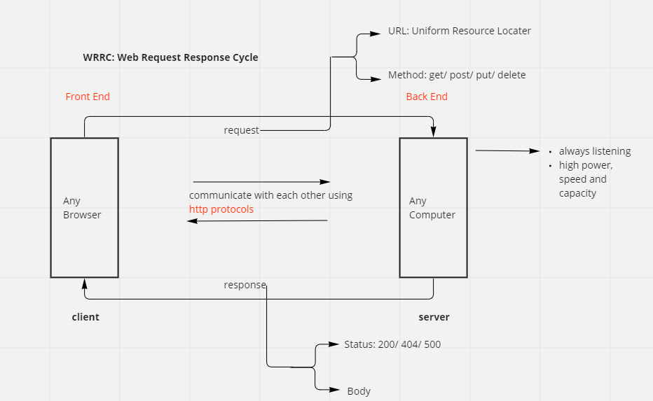
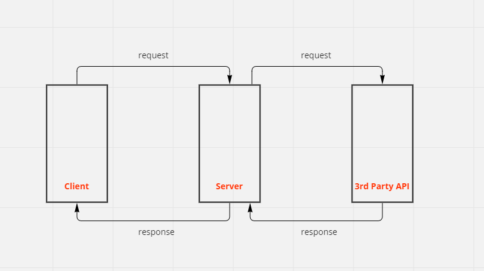

# Movies-Library

# Movies - 1.0.0

**Author Name**: Omar Al Ghonimat

## WRRC

## WRRC-3rd Party API

## Overview
preview movies with some information about them.

## Getting Started
1. require the package (express)
2. creat express app
3. make the server listen to a specific port (3000)
4. creat routes (endpoints)

## Project Features
- Home page >> Display the movie name and the poster path and an overview about the movie.
- Favorite page >>
Trending page >> shows the trending movies
- search >> enables the user to search for a movie title
- moviesTopRated >> show a lits of top rated movies
- TVTopRated >> show a lits of top rated TV series